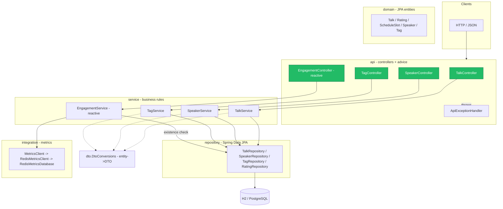
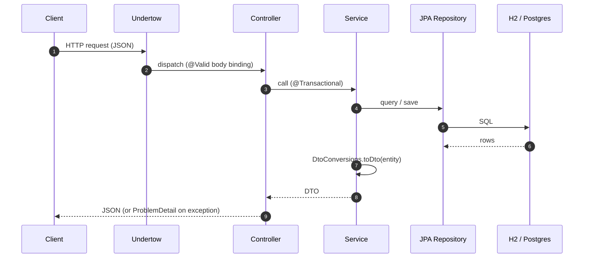
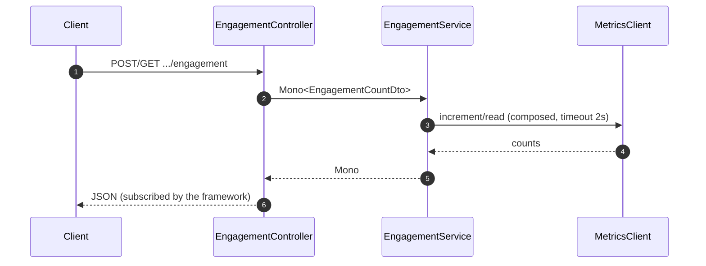
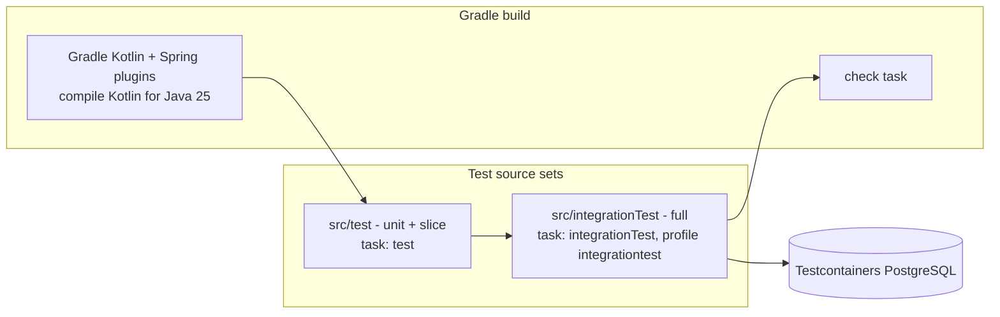

# Architecture Overview

> **Scope of this page.** This is a *structural* overview of the whole
> application — stack, layering, request flow, persistence, and build topology.
> It is anchored only to the composition root (`ConferenceWebsiteApplication`),
> so automated staleness `check` will not catch every structural drift. Re-review
> it when `doc_staleness.py coverage` reports a new surface, when packages/layers
> change, or when the build or runtime stack changes.

## 1. Summary
A **Kotlin Spring Boot conference-website domain**. It exposes a small REST API over four
features — [Talks](./talks.md), [Speakers](./speakers.md), [Tags](./tags.md),
[Engagement](./engagement.md) — backed by a relational store via JPA. Most of the
app is classic blocking Spring MVC; the Engagement feature is reactive
(Project Reactor). The repository's real purpose is a testbed for Kotlin testing
techniques, with Kotlin production code and Kotlin test/integration-test suites.

## 2. Technology Stack
| Concern | Choice |
|---|---|
| Language | Kotlin 2.3.20 (targeting Java 25) |
| Framework | Spring Boot 4.0.3 (`spring-boot-starter-parent`) |
| Web server | Embedded server from `spring-boot-starter-web` (no Undertow dependency declared) |
| Web model | Spring MVC (blocking) + Project Reactor `Mono` (Engagement) |
| Persistence | Spring Data JPA + Hibernate |
| Database | **Runtime:** H2 in-memory in PostgreSQL mode; **Integration tests:** PostgreSQL 16 via Testcontainers |
| Validation | Bean Validation (`starter-validation`, Jakarta constraints) |
| JSON | Jackson (+ `jackson-module-kotlin`) |
| Ops | Spring Boot Actuator |
| Nullness | JSpecify annotations |
| Build | Gradle (`build.gradle.kts`, `./gradlew`) with Kotlin JVM / Spring / JPA / power-assert plugins |
| Test | JUnit 5, Kotest assertions, MockK (`springmockk`), Reactor-test, kotlinx-coroutines-test |

## 3. Layered Architecture


Dependencies point strictly downward (`api → service → repository/domain`); the
graph confirms `service` (the `main` package core) has high fan-in and no
outward dependency on `api`. `DtoConversions` is a shared leaf every read path
funnels through.

## 4. Request Lifecycle

### Blocking path (Talks / Speakers / Tags)


### Reactive path (Engagement)

See [Engagement](./engagement.md) for the full reactive detail and the
in-memory metrics backend.

## 5. Module / Package Structure
```
com.conference.website
├── ConferenceWebsiteApplication   # @SpringBootApplication composition root
├── api            # REST controllers (surfaces) + ApiExceptionHandler
├── service        # business rules, @Transactional; NotFound/BadRequest exceptions
├── domain         # JPA entities: Talk, Rating, ScheduleSlot, Speaker, Tag, TalkLevel
├── dto            # Kotlin request/response data classes + mapping extensions
├── repository     # Spring Data JPA interfaces
└── integration    # metrics backend (MetricsClient/RedisMetricsClient/RedisMetricsDatabase),
                   # plus BuzzClient/FakeBuzzClient (present, not wired to endpoints)
```

## 6. Persistence & Data Model
- **Runtime:** H2 in-memory (`MODE=PostgreSQL`), `ddl-auto: update`,
  `open-in-view: false`, `spring.sql.init.mode: always`. State is **not durable**
  across restarts.
- **Integration tests:** PostgreSQL 16 via Testcontainers (JDBC URL
  `jdbc:tc:postgresql:16-alpine:///conference`), giving production-like behavior.
- Entity relationships (Talk aggregate with speakers/tags/ratings/slot) are
  detailed in [Talks §4](./talks.md). Engagement counters are **not** JPA
  entities — they live in the metrics backend keyed by `talkId`.

## 7. Cross-cutting Concerns
Error handling (RFC-7807 `ProblemDetail` via `ApiExceptionHandler`) and
entity→DTO conversion (`DtoConversions`) are shared by all features and
documented once in [cross-cutting](./cross-cutting.md).

## 8. Build & Test Topology

- **Unit/slice tests** (`src/test`, Gradle `test`) run against H2 / mocks.
- **Integration tests** (`src/integrationTest`, Gradle `integrationTest`, profile
  `integrationtest`) run against real PostgreSQL.
- `check` depends on `integrationTest`, so the default verification pipeline includes both test layers.
- Kotlin test tooling: AssertJ, Kotest assertions, MockK, power-assert, Reactor-test.

## 9. Notable Characteristics & Constraints
- **No authentication/authorization** on the API surfaces.
- **In-memory everything by default:** H2 data and engagement counters reset on
  restart; the "Redis" metrics classes are an in-memory fake.
- **Kotlin DTO boundary:** request and response `data class`es in `dto/` are the
  HTTP contract; entities remain internal.
- **Mixed concurrency models:** blocking MVC everywhere except the reactive
  Engagement endpoints; reactive errors are not mapped by `ApiExceptionHandler`.
- **Undertow, not Tomcat** — relevant for server tuning and metrics.

## 10. Related Documentation
- Features: [Talks](./talks.md) · [Speakers](./speakers.md) · [Tags](./tags.md) · [Engagement](./engagement.md)
- [Cross-cutting concerns](./cross-cutting.md)
- Tooling: [docs/tools/README.md](./tools/README.md) — staleness, impact, blast-radius, coverage
