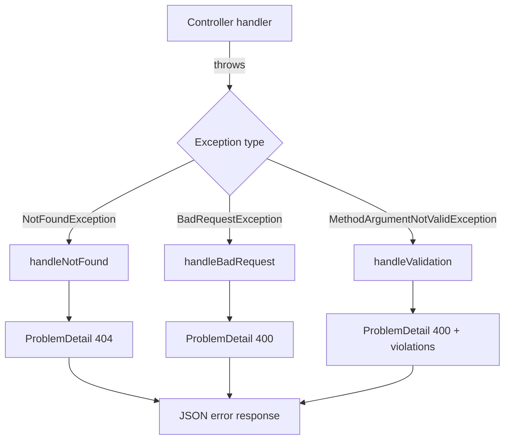

# Cross-cutting concerns

Shared machinery used by every feature. Feature docs `reference` these symbols
rather than re-documenting them, so a change here is caught by *this* page.

## 1. Error model (RFC 7807 `ProblemDetail`)
`ApiExceptionHandler` is a `@RestControllerAdvice` translating domain exceptions
into `ProblemDetail` responses with a stable `type` URI, a `title`, and the
exception message as `detail`.

| Exception | HTTP status | `type` URI | Notes |
|-----------|-------------|------------|-------|
| `NotFoundException` | 404 Not Found | `…/errors/not-found` | thrown by services when an id is unknown |
| `BadRequestException` | 400 Bad Request | `…/errors/bad-request` | domain/validation rule violations |
| `MethodArgumentNotValidException` | 400 Bad Request | `…/errors/validation` | bean-validation failures; adds a `violations[]` property (`field: message`) |

Both `NotFoundException` and `BadRequestException` are unchecked
(`RuntimeException`) and live in the `service` package.

> **Gap:** only these three exception types are handled. Errors from the reactive
> [Engagement](./engagement.md) path (e.g. a 2s timeout) are not mapped here and
> surface with the framework default.

## 2. DTO conversion (`DtoConversions.kt`)
Kotlin extension functions that map JPA entities to response DTOs. Key responsibilities:
- `toDto(Talk)` → `TalkDto`, including **derived** `averageRating` (mean of
  rating scores) and `totalRatings` (count), plus nested speaker/tag/rating DTOs,
  the schedule slot, `evaluationStatus`, and the moderation discussion thread
  (`moderationMessages`, sorted oldest-first — the reverse order of `ratings`).
- `toDto(Speaker)` → `SpeakerDto`, `toDto(Tag)` → `TagDto`,
  `toDto(Rating)` → `RatingDto`, `toDto(ModerationMessage)` → `ModerationMessageDto`.
- `toScheduleSlotResponse(ScheduleSlot)` → `ScheduleSlotDto`.

Because nearly every read path funnels through the `toDto` extensions, they have high fan-in — a
change here has a wide **blast radius**. That is why it is documented here once
and only `reference`d elsewhere: use
the live codebase-memory MCP graph (trace_path or query_graph) to see which
feature docs a change to DtoConversions.kt would ripple into.

## 3. Kotlin HTTP DTOs
The types in `com.conference.website.dto` are the sole wired HTTP contract. They
are Kotlin `data class`es, with `@JvmRecord` used where Java-record bytecode
interoperability is desired. There is no separate experimental DTO package.

## 4. Related Documentation
- All feature docs reference this page for their error responses.
