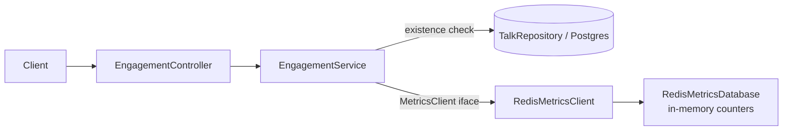
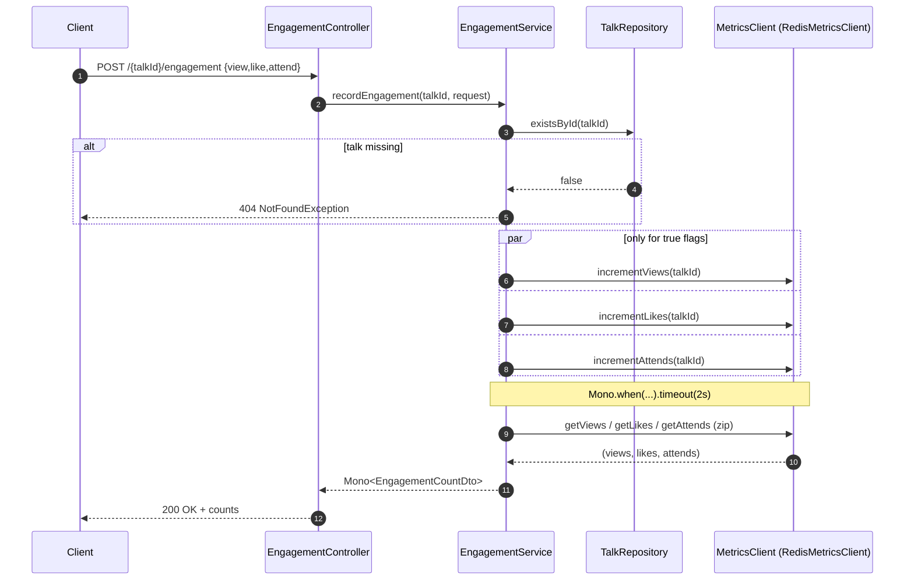

# Engagement

## 1. Introduction / Summary
**Engagement** tracks per-talk interaction counters — **views**, **likes**, and
**attends**. Unlike the rest of the app (blocking Spring MVC), this feature is
**reactive** (Project Reactor `Mono`): counters live in a metrics backend behind
`MetricsClient`, and reads/writes are composed asynchronously with a timeout.

## 2. API / Surface Reference
Base path: `/api/talks/stats` (`EngagementController`). Both endpoints return a
`Mono<EngagementCountDto>` (serialized to a single JSON object).

| Method | Path | Request | Response | Success | Errors |
|--------|------|---------|----------|---------|--------|
| `POST` | `/api/talks/stats/{talkId}/engagement` | `EngagementUpdateRequest` | `EngagementCountDto` | 200 | 404, 504* |
| `GET`  | `/api/talks/stats/{talkId}/engagement` | – | `EngagementCountDto` | 200 | 404, 504* |

- `EngagementUpdateRequest { view, like, attend }` — booleans; only the `true`
  flags are incremented.
- `EngagementCountDto { talkId, views, likes, attends }` — the current totals,
  always re-read after a write.
- *A backend slower than the 2s `CLIENT_TIMEOUT` fails the `Mono` with a
  timeout; the mapping to an HTTP status is not customized by
  `ApiExceptionHandler` (see [cross-cutting](./cross-cutting.md)).

## 3. Functional Description
`POST` first confirms the talk exists, then fires the requested increments
concurrently, and finally returns the freshly-read counts. `GET` just reads the
three counters concurrently. Both bound the backend interaction with a 2-second
timeout.

## 4. Entity Descriptions
Engagement has **no JPA entity** of its own. Counters are stored in the metrics
backend keyed by `talkId`; talk existence is checked against the relational
`TalkRepository`.

### Components

> Naming note: `RedisMetricsClient` / `RedisMetricsDatabase` model a Redis-style
> counter store but the current `RedisMetricsDatabase` is an **in-memory** map —
> there is no real Redis connection. `BuzzClient` / `FakeBuzzClient` also live in
> `integration/` but are **not wired** into these endpoints.

## 5. Technical Lifecycle

### Record engagement (write-then-read)

## 6. Business Rules
1. **Talk must exist.** `EngagementService.ensureTalkExists` (called by both
   `recordEngagement` and `getCurrentEngagement`) → 404 `NotFoundException`.
2. **Only requested counters are incremented.** A `false` flag maps to
   `Mono.empty()` (no-op).
3. **A write is always followed by a fresh read.** `recordEngagement` returns
   `getCurrentEngagement(talkId)` so the response reflects post-write totals.
4. **Backend calls are bounded** by `CLIENT_TIMEOUT` (2s).

## 7. Notable Exceptions & Edge Cases
- **No request-body validation.** `EngagementController.recordEngagement` uses a
  plain `@RequestBody` (no `@Valid`); all-false requests are accepted and simply
  return current counts.
- **Timeouts** surface as a reactive error rather than a curated `ProblemDetail`.
- **Counters are not durable** in the current in-memory backend — they reset when
  the app restarts.

## 8. Related Documentation
- [Talks](./talks.md) — engagement is keyed by talk id; talk existence gates it.
- [Cross-cutting concerns](./cross-cutting.md) — error model.
