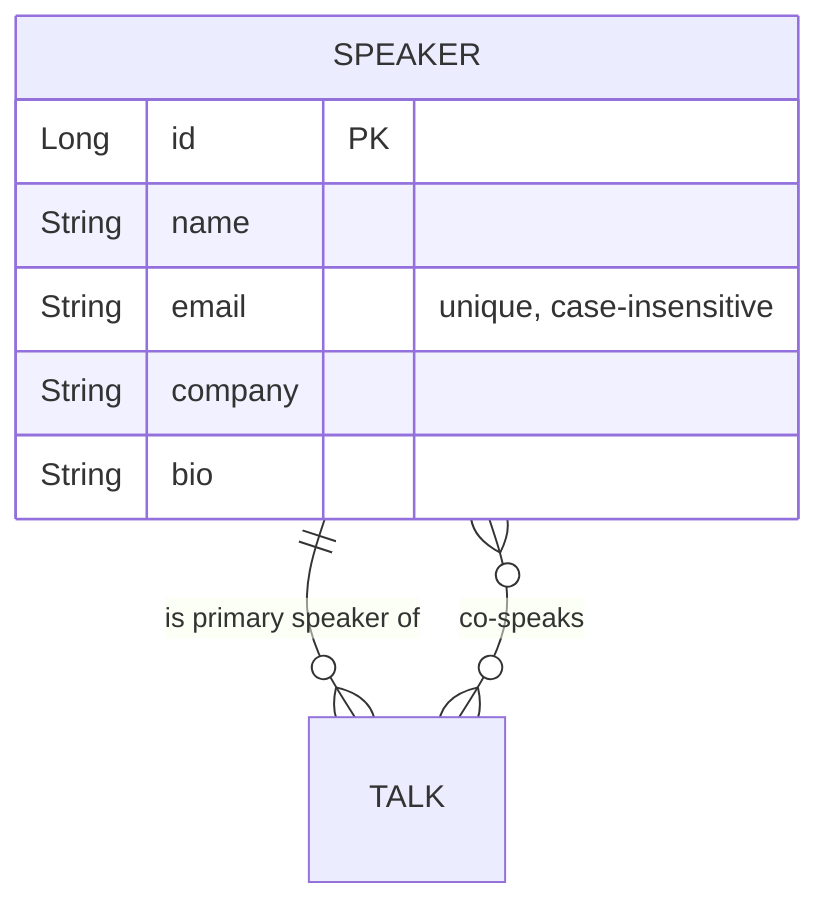
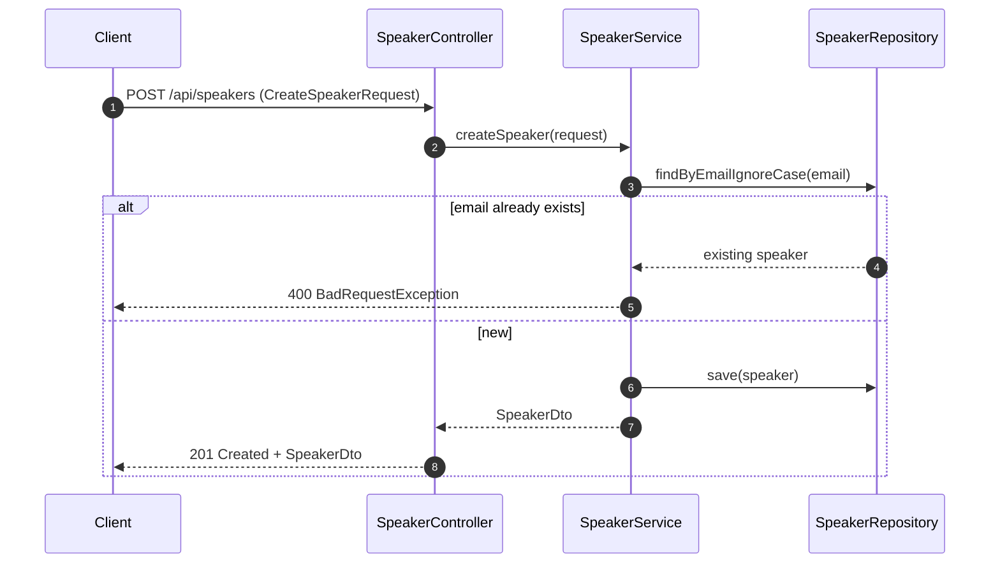

# Speakers

## 1. Introduction / Summary
A **Speaker** is a person who presents talks. Speakers are created independently
and then referenced by id when creating a [Talk](./talks.md) (as primary speaker
or co-speaker). This feature owns creating and listing speakers.

## 2. API / Surface Reference
Base path: `/api/speakers` (`SpeakerController`).

| Method | Path | Request | Response | Success | Errors |
|--------|------|---------|----------|---------|--------|
| `POST` | `/api/speakers` | `CreateSpeakerRequest` | `SpeakerDto` | 201 | 400 |
| `GET`  | `/api/speakers` | – | `SpeakerDto[]` | 200 | – |

`SpeakerService` also exposes `getSpeakerById` (returns nullable `SpeakerDto?`), but **no
GET-by-id endpoint is wired** — it is used internally / by tests.

## 3. Functional Description
Creating a speaker validates the request body and rejects a duplicate email
(case-insensitive) before persisting. Listing returns all speakers. Speakers have
no lifecycle beyond creation (no update/delete surface).

## 4. Entity Descriptions

### Speaker (`speakers` table)
- **Purpose:** a presenter.
- **Fields:** `id`, `name`, `email`, `company`, `bio`.
- **Referenced by:** `Talk.primarySpeaker` (required) and `Talk.coSpeakers`.

## 5. Technical Lifecycle

A persisted speaker is effectively terminal — no state transitions.

## 6. Business Rules
1. **Email must be unique (case-insensitive).** `SpeakerService.createSpeaker`
   → 400 `BadRequestException` ("Speaker email already exists: …").
2. **Request-body validation.** `CreateSpeakerRequest` requires non-blank
   `name`, `company`, `bio` and a `@NotBlank @Email` `email` → 400 on violation.

## 7. Notable Exceptions & Edge Cases
- **Duplicate email → 400** (not 409) when the service's case-insensitive
  pre-check observes it. The entity also declares a database unique constraint;
  a concurrent constraint violation is not translated by `ApiExceptionHandler`.

## 8. Related Documentation
- [Talks](./talks.md) — consumes speakers by id.
- [Cross-cutting concerns](./cross-cutting.md) — error model, DTO conversion.
