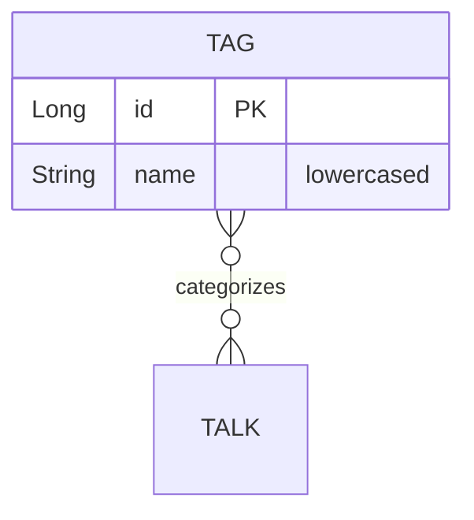

# Tags

## 1. Introduction / Summary
A **Tag** is a lowercase label used to categorize talks. Tags are created in
batches and later attached to a [Talk](./talks.md) by id. This feature owns
creating and listing tags.

## 2. API / Surface Reference
Base path: `/api/tags` (`TagController`).

| Method | Path | Request | Response | Success | Errors |
|--------|------|---------|----------|---------|--------|
| `POST` | `/api/tags` | `CreateTagsRequest` (`names: string[]`) | `TagDto[]` | 201 | 400 |
| `GET`  | `/api/tags` | – | `TagDto[]` | 200 | – |

## 3. Functional Description
`POST` accepts a non-empty list of names, normalizes them to lowercase, and
persists them as tags, returning the created tags. `GET` returns all tags.

## 4. Entity Descriptions

### Tag (`tags` table)
- **Purpose:** a categorization label.
- **Fields:** `id`, `name` (stored lowercased).
- **Referenced by:** `Talk.tags` (`@ManyToMany`).

## 5. Technical Lifecycle
Created once via `createTags` and persisted; no update/delete surface. Names are
lowercased on the way in (both in the "already exists" lookup and before save).

## 6. Business Rules
1. **`names` must be non-empty.** `CreateTagsRequest.names` is `@NotEmpty` → 400.
2. **Reject only when *every* requested name already exists.**
   `TagService.createTags` compares the count of existing (case-insensitive)
   matches to the request size; if they are equal it throws 400
   `BadRequestException` ("Tag already exists: …").

## 7. Notable Exceptions & Edge Cases
- **Partial-overlap batches are NOT de-duplicated.** If some names already exist
  but not all, the guard in rule 2 does not fire and the service saves *all*
  requested names (lowercased) as new `Tag` rows — so duplicate tag names can be
  created. Treat this as current documented behavior, not an intended feature;
  flag if a uniqueness guarantee is required.

## 8. Related Documentation
- [Talks](./talks.md) — attaches tags by id.
- [Cross-cutting concerns](./cross-cutting.md) — error model, DTO conversion.
