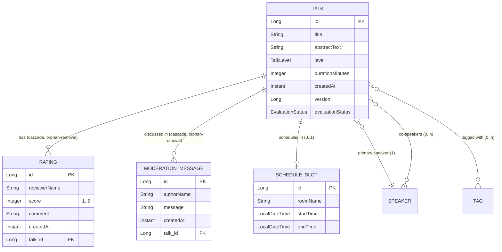
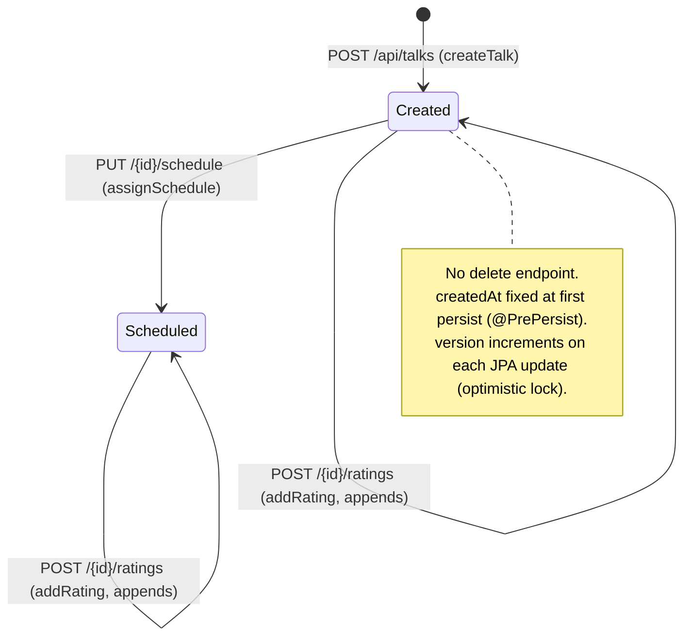
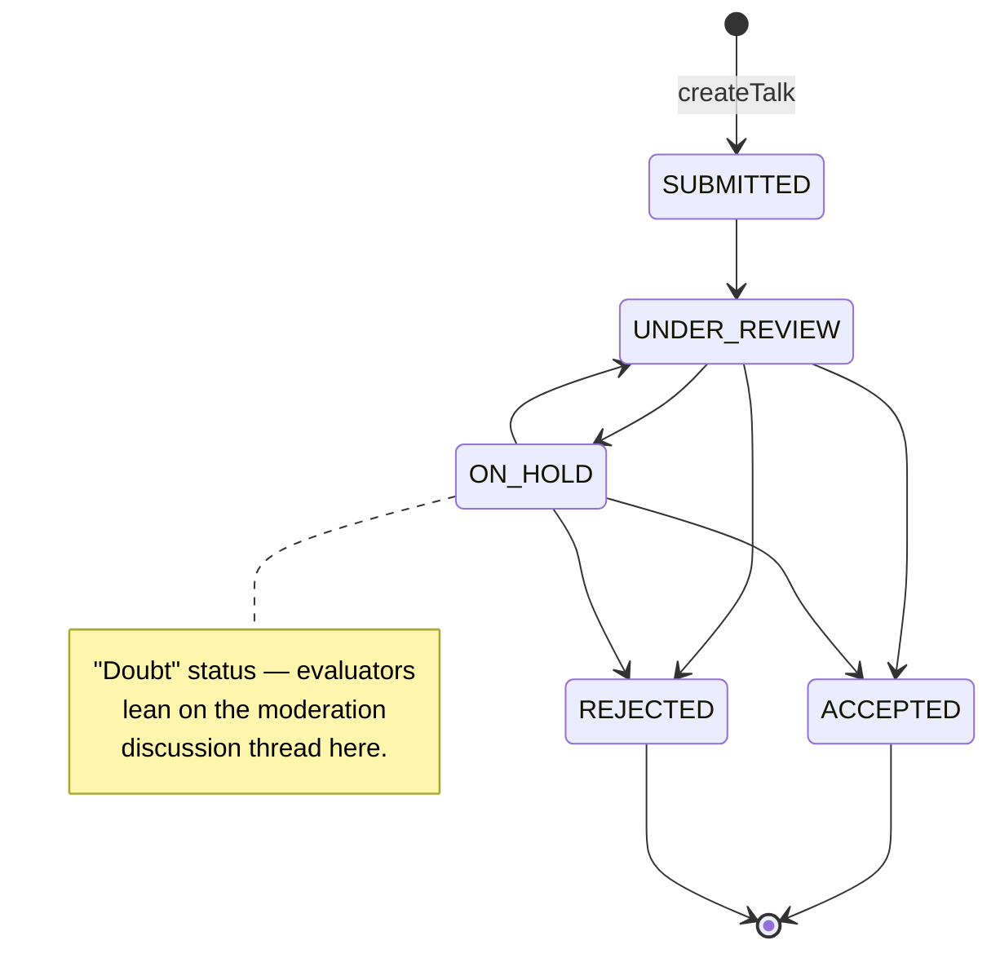
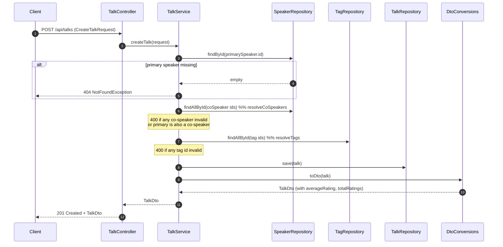

# Talks

## 1. Introduction / Summary
A **Talk** is the core content unit of the conference website: a titled session
with an abstract, a difficulty level, and a duration, delivered by one primary
speaker and optional co-speakers. Talks can be tagged, scheduled into a room/time
slot, and rated by attendees. This feature owns creating talks, listing/reading
them, attaching ratings, and assigning a schedule. Per-talk engagement counters
(views/likes/attends) are a separate concern — see [Engagement](./engagement.md).

Every talk also carries a **CFP moderation workflow**: an `evaluationStatus`
tracking where the submission stands in the decision process, and a
**moderation discussion thread** — a back-channel of `ModerationMessage`s that
evaluators post to each other about the submission. This is distinct from
`Rating`, which is the formal attendee/evaluator verdict (score + comment); the
discussion thread is evaluators talking *to each other*, not to the speaker or
the public.

## 2. API / Surface Reference
Base path: `/api/talks` (`TalkController`). All bodies are JSON. Errors use the
shared RFC-7807 `ProblemDetail` format documented in [cross-cutting](./cross-cutting.md).

| Method | Path | Request | Response | Success | Errors |
|--------|------|---------|----------|---------|--------|
| `POST` | `/api/talks` | `CreateTalkRequest` | `TalkDto` | 201 | 400, 404 |
| `GET`  | `/api/talks?level=&tag=` | – | `TalkDto[]` | 200 | – |
| `GET`  | `/api/talks/{talkId}` | – | `TalkDto` | 200 | 404 |
| `POST` | `/api/talks/{talkId}/ratings` | `CreateRatingRequest` | `TalkDto` | 201 | 400, 404 |
| `PUT`  | `/api/talks/{talkId}/schedule` | `ScheduleSlotRequest` | `TalkDto` | 200 | 400, 404 |
| `POST` | `/api/talks/{talkId}/moderation-messages` | `CreateModerationMessageRequest` | `TalkDto` | 201 | 400, 404 |
| `PUT`  | `/api/talks/{talkId}/evaluation-status` | `UpdateEvaluationStatusRequest` | `TalkDto` | 200 | 400, 404 |

Notes:
- **`GET /api/talks`** takes optional query params: `level` (`BEGINNER` \|
  `INTERMEDIATE` \| `ADVANCED`) **or** `tag` (tag name, case-insensitive). With
  neither, all talks are returned newest-first. `level` takes precedence over `tag`.
- **Ratings, schedule, moderation-message, and evaluation-status endpoints all
  return the full updated `TalkDto`**, not a fragment — so the caller sees
  recomputed `averageRating` / `totalRatings`, the current slot, the full
  discussion thread, and the current status in one round-trip.
- `TalkDto` exposes derived fields `averageRating` and `totalRatings` computed
  from the talk's ratings by `DtoConversions.toDto`.
- `TalkDto.moderationMessages` is returned **oldest-first** (chronological
  reading order for a discussion thread) — the opposite order to
  `TalkDto.ratings`, which is newest-first.

## 3. Functional Description
Creating a talk requires an existing primary speaker (referenced by id) and, if
supplied, existing co-speakers and tags. The service validates these references,
constructs the `Talk`, and persists it. Every new talk starts in evaluation
status `SUBMITTED`. Reads either list talks (optionally filtered) or fetch one
in detail. Attendees submit ratings (score 1–5) against an existing talk;
organizers assign or replace a talk's schedule slot. Evaluators post free-text
messages to the talk's moderation discussion thread and move the talk through
its evaluation status pipeline (`SUBMITTED → UNDER_REVIEW → ON_HOLD →
ACCEPTED`/`REJECTED`); invalid transitions are rejected. There is no delete
surface for talks, ratings, or moderation messages.

## 4. Entity Descriptions

### Talk (`talks` table)
- **Purpose:** the session.
- **Fields:** `id`, `title`, `abstractText` (≤4000), `level` (`TalkLevel`,
  stored as string), `durationMinutes`, `createdAt` (set on persist), `version`
  (optimistic-locking column), `evaluationStatus` (`EvaluationStatus`, stored as
  string, required — set to `SUBMITTED` on creation).
- **Relationships:** `@ManyToOne` **primary speaker** (required); `@ManyToMany`
  **co-speakers** and **tags**; `@OneToMany` **ratings** (cascade-all,
  orphan-removal); `@OneToMany` **moderationMessages** (cascade-all,
  orphan-removal); `@OneToOne` **scheduleSlot** (cascade-all, orphan-removal).
- **Invariants:** non-null title/abstract/level/duration/primary
  speaker/evaluationStatus; `durationMinutes ≥ 5` (enforced at the DTO
  boundary).

### Rating (`ratings` table)
- **Purpose:** one attendee's score+comment for a talk. The formal verdict.
- **Fields:** `id`, `reviewerName`, `score` (1–5), `comment` (≤2000),
  `createdAt`. `@ManyToOne` back to its `Talk` (required).

### ModerationMessage (`moderation_messages` table)
- **Purpose:** one entry in the evaluators' back-channel discussion about a
  submission — distinct from `Rating`, which is the formal verdict. Not
  attendee/speaker-facing.
- **Fields:** `id`, `authorName`, `message` (≤2000), `createdAt` (set on
  persist). `@ManyToOne` back to its `Talk` (required).
- **Invariants:** non-null/non-blank `authorName`/`message`. No edit or delete
  surface — messages are append-only.

### ScheduleSlot (`schedule_slots` table)
- **Purpose:** the room + time window a talk is scheduled into.
- **Fields:** `id`, `roomName`, `startTime`, `endTime` (`LocalDateTime`).
- **Invariant:** `endTime` strictly after `startTime` (enforced in the service).

### TalkLevel (enum)
`BEGINNER`, `INTERMEDIATE`, `ADVANCED`.

### EvaluationStatus (enum)
`SUBMITTED`, `UNDER_REVIEW`, `ON_HOLD`, `ACCEPTED`, `REJECTED`. See
[Business Rules](#6-business-rules) for the allowed transition graph.
`ON_HOLD` ("doubt") is the status evaluators use when they need to lean on the
moderation discussion thread to reach a decision.

### Data model

## 5. Technical Lifecycle

Persistence: `createTalk` saves a new aggregate; `assignSchedule` mutates the
loaded talk's slot (cascade persists/replaces the `ScheduleSlot`); `addRating`
appends a `Rating` to the managed collection; `addModerationMessage` appends a
`ModerationMessage` to the managed collection; `updateEvaluationStatus`
validates and mutates `evaluationStatus`. Reads for a single talk use
`TalkRepository.findDetailedById` (fetches the object graph — including
`moderationMessages` — in one query).

### Evaluation status pipeline

`TalkService.updateEvaluationStatus` (`PUT /{id}/evaluation-status`) enforces
this graph — any edge not drawn above is a 400 `BadRequestException`. `ACCEPTED`
and `REJECTED` are terminal: no further transitions are allowed out of them.

### Create flow

## 6. Business Rules
1. **Primary speaker must exist.** `TalkService.createTalk` → 404
   `NotFoundException` if `primarySpeaker.id` is unknown.
2. **All co-speakers must exist.** `TalkService.resolveCoSpeakers` → 400
   `BadRequestException` ("One or more co-speaker are invalid").
3. **Primary speaker cannot also be a co-speaker.** `resolveCoSpeakers` → 400.
4. **All referenced tags must exist (by id).** `TalkService.resolveTags` → 400
   ("One or more tag names are invalid").
5. **Schedule `endTime` must be strictly after `startTime`.**
   `TalkService.toScheduleSlot` → 400.
6. **Rating / schedule / moderation-message / evaluation-status changes require
   an existing talk.** `addRating` / `assignSchedule` / `addModerationMessage` /
   `updateEvaluationStatus` load via `findDetailedById` → 404 if absent.
7. **Request-body validation.** `CreateTalkRequest` (`@NotBlank`, `@NotNull`,
   `durationMinutes @Min(5)`), `CreateRatingRequest` (`score @Min(1) @Max(5)`,
   `@NotBlank` reviewerName/comment), and `CreateModerationMessageRequest`
   (`@NotBlank` authorName, `@NotBlank @Size(max=2000)` message) → 400 on
   violation.
8. **Evaluation status only moves along the allowed transition graph.**
   `TalkService.updateEvaluationStatus` → 400 `BadRequestException` for any
   edge not in the pipeline above (e.g. `SUBMITTED → ACCEPTED`, or any
   transition out of `ACCEPTED`/`REJECTED`).

## 7. Notable Exceptions & Edge Cases
- **Unknown `talkId` → 404** on GET-by-id, ratings, schedule, moderation-message,
  and evaluation-status endpoints.
- **Invalid body → 400** with a `violations` list (bean validation) — see
  [cross-cutting](./cross-cutting.md).
- **Re-scheduling replaces** the existing slot rather than adding one (`@OneToOne`
  with orphan removal).
- **Optimistic locking:** concurrent updates to the same talk can raise an
  optimistic-lock failure via the `version` column.
- **List filtering is exclusive:** `level` is checked before `tag`; passing both
  effectively ignores `tag`.
- **No re-transition to the same status:** the transition graph has no self-loops,
  so e.g. `UNDER_REVIEW → UNDER_REVIEW` is rejected like any other disallowed edge.
- **Moderation messages are append-only:** no edit or delete surface; the thread
  only grows.

## 8. Related Documentation
- [Speakers](./speakers.md) — talks reference a primary speaker and co-speakers.
- [Tags](./tags.md) — talks are tagged by existing tag ids.
- [Engagement](./engagement.md) — view/like/attend counters per talk.
- [Cross-cutting concerns](./cross-cutting.md) — error model, DTO conversion.
